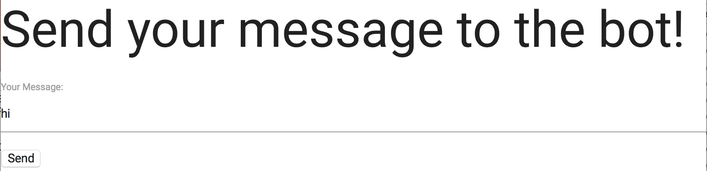
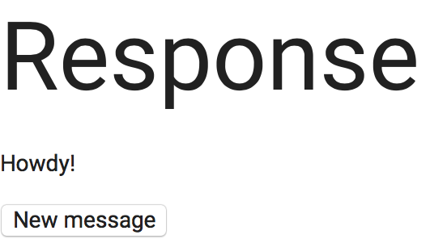

# Creative_Rails_Project

Adam Schulze and Thomas Dickstein

# Project Summary

A simple chatbot designed to respond to messages from users. Responses will be selected randomly from among a set list of pre-programmed responses.

# Project Users

This bot is for anyone who has an internet connection and desires to have a useless conversation with a faceless bot on the Web.

# MVP

* Users can type messages into a message box

* Users can click send to feed their message to the bot

* The bot should be able to respond when a message is sent

* Users should be able to view responses to their messages

# Functionality

The current version of the product allows users to type in a message to send to the bot, which is then sent to the bot when the "send" button is clicked. This is shown in the screenshot below.





This will load the bot's response (shown below). 





The user can then reply to this response with a new message by clicking the "new message" button. The bot currently has 8 pre-programmed responses.

# Installation Steps

1. Clone or download this repository from GitHub.
2. cd into your local version of the repository, and run ```bundle install``` to install the required gems.
3. run the command ```rails server``` to run the bot on a local server.
4. Go to ```http://localhost:3000``` in your browser to start using the bot.

# Key Issues

* The original rails tutorial we were basing our app off of was inconsitent in terms of what the author had written and what was in their GitHub repository. We continued to draw inspiration from this tutorial, but ultimately shifted to different sources when actually implementing our bot. 

* We were unable to read input from an html form so that our bot could appropriately respond. We switched to a rails form, which allowed us to use ```param``` to pass user input to our bot.

# Known Bugs

No known bugs as of now.

# References

“Form Helpers.” Form Helpers - Ruby on Rails Guides, guides.rubyonrails.org/form_helpers.html.

“Getting Started - Creating the Blog Application.” Ruby on Rails Guides, guides.rubyonrails.org/getting_started.html#creating-the-blog-application.

Gonzalez, Ivan. “Make a Conversational Bot in Ruby on Rails from Scratch.” Dreamingechoes, 2016, dreamingechoes.github.io/bot/ruby/rails/conversational-bot-ruby-on-rails/.

“How to Check Whether a String Contains a Substring in Ruby?” Stack Overflow, 24 Nov. 2011, stackoverflow.com/questions/8258517/how-to-check-whether-a-string-contains-a-substring-in-ruby.

“HTML Forms.” w3schools.com, www.w3schools.com/html/html_forms.asp.

“What Is the Difference between .Erb, .Rhtml, and .Html.erb?” Stack Overflow, 29 May 2010, stackoverflow.com/questions/2936326/what-is-the-difference-between-erb-rhtml-and-html-erb.

“Writing Our Own Class in Ruby: Ruby Study Notes - Best Ruby Guide, Ruby Tutorial.” Rubylearning.com, rubylearning.com/satishtalim/writing_our_own_class_in_ruby.html.
